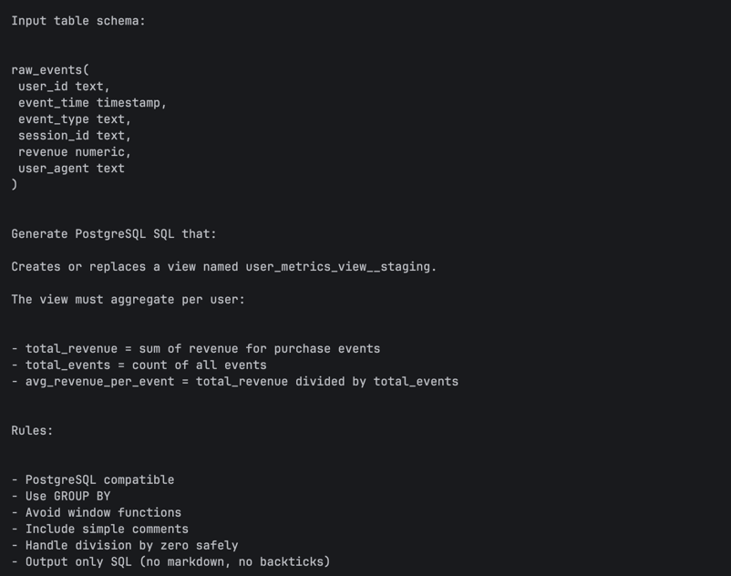
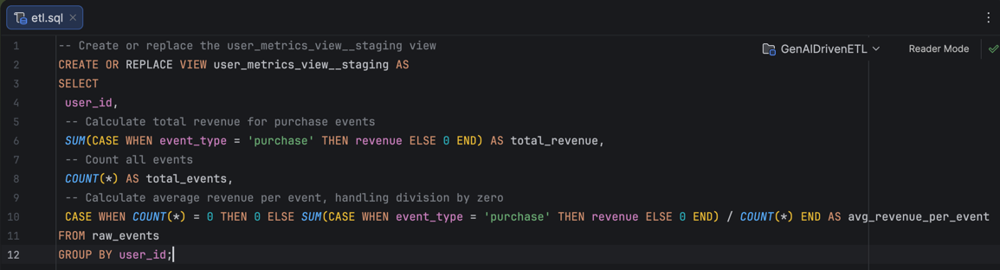
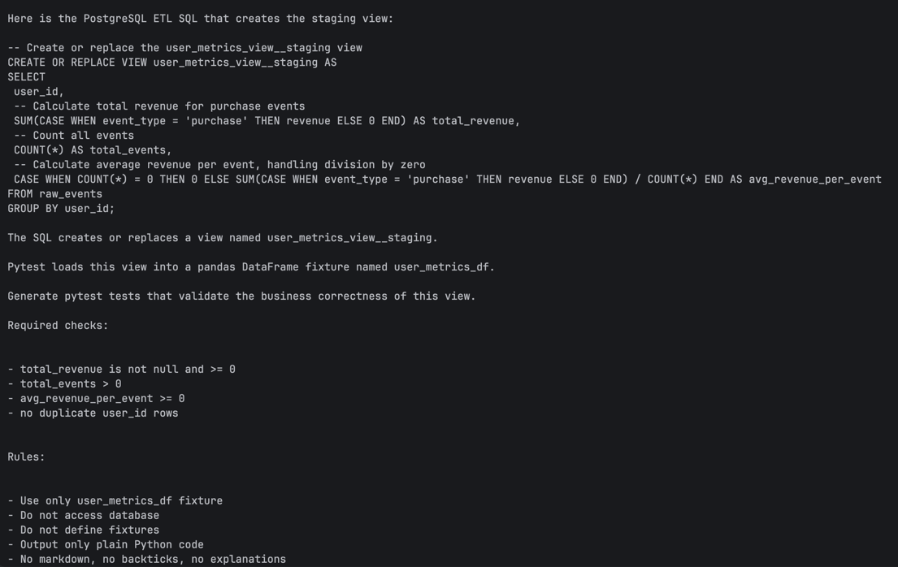
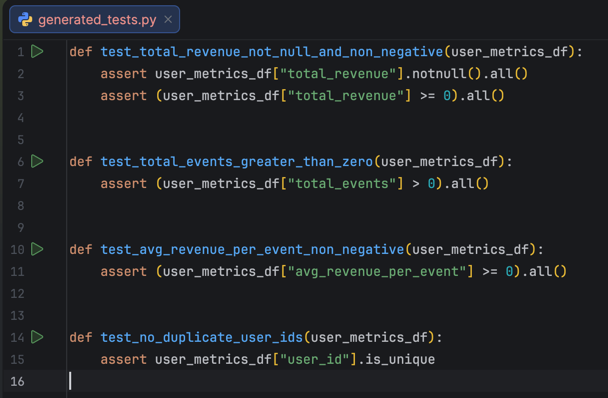
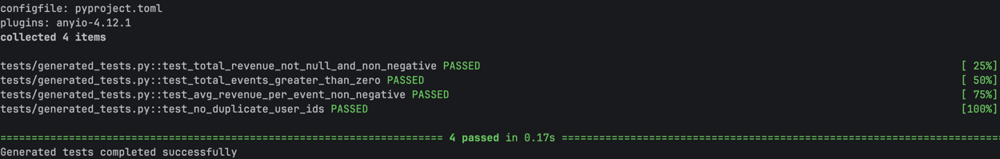
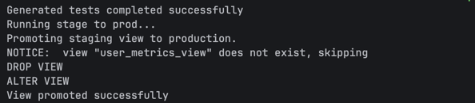

# LangChain SQL & Test Generator

**GenAIDrivenETL** is a LangChain-powered data engineering project that automatically generates SQL transformations and corresponding pytest tests from raw event schemas and business rules.
The project demonstrates how LLM orchestration can be integrated into a production-style ETL workflow with validation, testing, and code quality enforcement.

---

Architecture Overview

SQL Prompt -> LangChain LLM -> Generated SQL (View) -> Test Prompt -> LangChain LLM -> Generated Pytest Tests -> Test Execution -> View Promotion (staging → final)

---

## Features

- LangChain LCEL-based orchestration pipeline

- Automatic SQL generation from raw schema + rules

- Automatic `pytest` test generation

- PostgreSQL integration (staging → final views)

- SQL validation before execution

- Rollback on test failure

- PEP8 linting (Black, isort, Flake8)

- Fully reproducible environment with Poetry

---

## GenAI Usage

- This project demonstrates practical GenAI usage in Data Engineering:

- Schema-driven SQL generation

- Metric aggregation logic generation

- Automated data quality test creation

- LLM-based orchestration via LangChain LCEL

---

## Setup
### 0) Requirements

- Python 3.11+

- PostgreSQL running locally

- Poetry installed

### 1) Clone repository
```bash
git clone https://github.com/romandevyatov/GenAIDrivenETL.git
cd GenAIDrivenETL
```

### 2) Install dependencies
```bash
poetry install
```

### 3) Create .env file in the project root:

 * OPENROUTER_API_KEY=your_openrouter_key
 * DB_NAME=genai_etl_db_any
 * DB_HOST=localhost
 * DB_PORT=5432
 * DB_USER=your_db_user
 * DB_PASSWORD=your_db_password
 * VIEW_NAME=your_table_name_any
 * STAGING_VIEW_NAME=your_staging_table_name_any

### 4) Run pipeline:
```bash
./scripts/run_all.sh
```
- _This script sequentially runs:_
  - init_db.sh
  - run_main_pipeline.sh
  - run_generated_tests.sh
  - run_commit_views.sh
  - run_lint.sh

---

## macOS users

Make scripts executable:

```bash
chmod +x ./scripts/*.sh
```

---

## Generated Artifacts

Generated SQL:
```bash
data/generated_outputs/sql/etl.sql
```

Generated tests:
```bash
tests/generated_tests.py
```

Staging View:
```bash
user_metrics_view__staging
```

Final View:
```bash
user_metrics_view
```

---

## Code Quality

Autoformat code with Black and isort:

```bash
poetry run black .
poetry run isort .
```

Check PEP8 compliance with Flake8:
```bash
poetry run flake8 .
```

Optional: Run full lint script:
```bash
./scripts/run_lint.sh
```
---

## Notes

ETL SQL is generated automatically and saved under _data/generated_outputs/sql/etl.sql_.

Views such as _user_metrics_view__staging_ and _user_metrics_view_ are created dynamically.

You can add new metrics editing `aggregates` in the [sql generation prompt](genaidrivenetl/prompts/v1/sql_prompt.txt).
As well, you can generate new tests by editing `required_checks` in the [test generation prompt](genaidrivenetl/prompts/v1/test_prompt.txt).
The project uses Poetry for reproducible environments. Check [config file](genaidrivenetl/config.py).

---

## Screenshots

1. Prompt to generate SQL query

2. Generated SQL

3. Prompt for test generation

4. Generated tests  

5. Run generated tests
  
Executed generated SQL queries on user event streams and transactional data to produce analytics metrics and validate results  
6. Update the table if tests completed successfully (stage —> prod)

