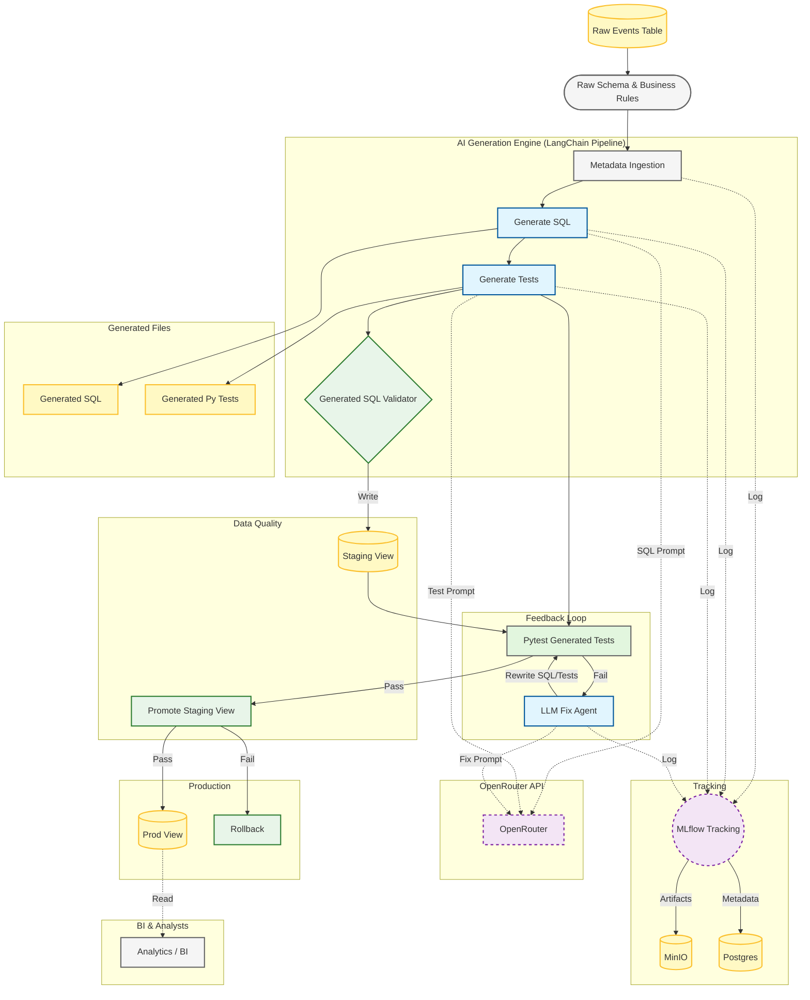
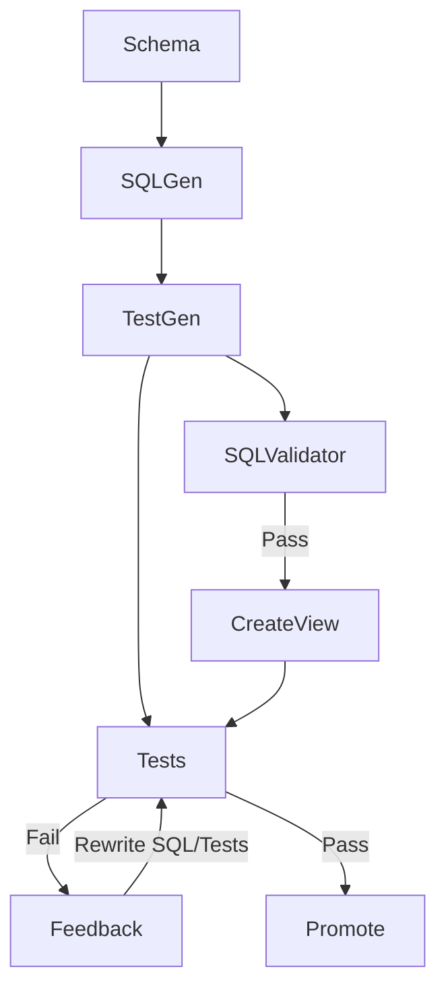
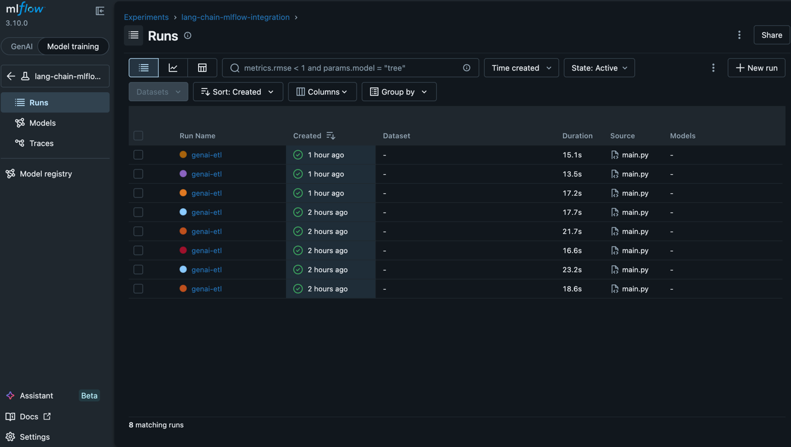
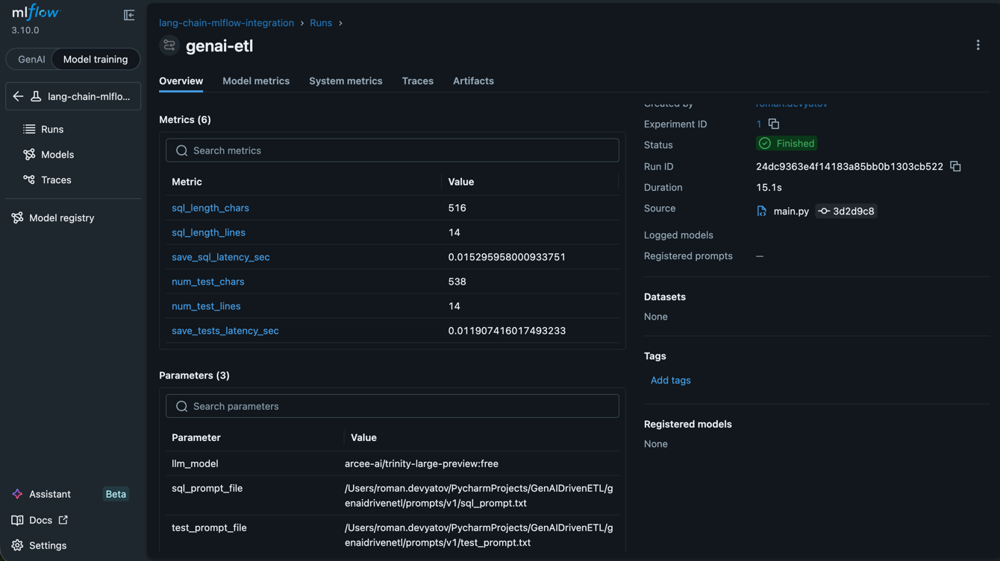
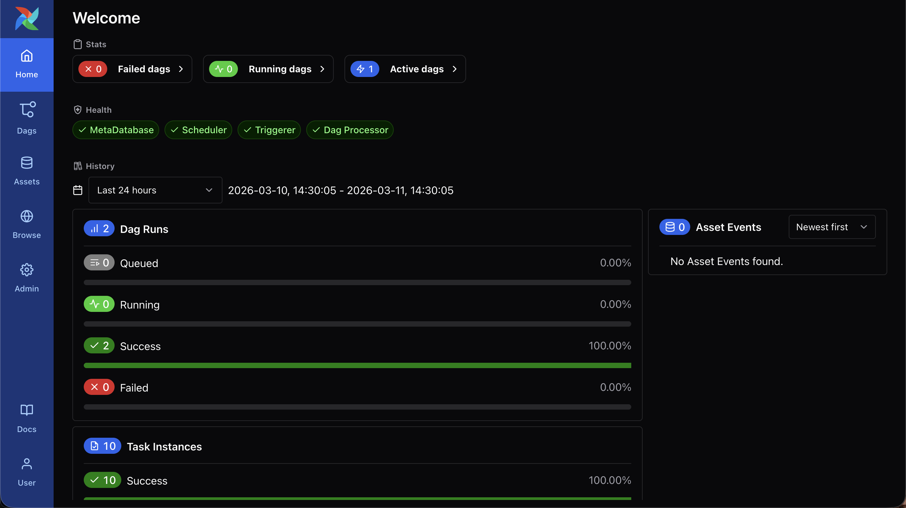

# AI-Driven SQL & Test Generator

An AI-driven data pipeline that generates SQL transformations and corresponding pytest tests from raw schemas.  
The system validates generated SQL and uses a self-correcting feedback loop to ensure correctness before promoting changes to production.

Pipeline: Schema → SQL Generation → Validation → Test Generation → Test Execution → Promote  
Stack: LangChain · Airflow · MLflow · MinIO · PostgreSQL · Docker

## Overview

This project demonstrates how Large Language Models (LLMs) can assist data engineering workflows by automatically generating SQL and data quality tests.  
All generated SQL is validated and tested; failing outputs are automatically corrected via a feedback loop before promotion to production.  
The workflow is orchestrated with Apache Airflow, and all artifacts, parameters, and metrics are tracked in MLflow for reproducibility and observability.

**Enables automated promotion of production-ready SQL transformations with zero manual intervention.**

---

### Architecture Overview


```mermaid
graph TD


   Table[("Raw Events Table")] --> Start
   Start([Raw Schema & Business Rules]) --> Ingestion[Metadata Ingestion]


   subgraph "AI Generation Engine (LangChain Pipeline)"
       Ingestion --> SQLGenNode[Generate SQL]
       SQLGenNode --> TestGenNode[Generate Tests]
       TestGenNode --> SQLValidator
   end


   subgraph "Generated Files"
       GeneratedSql["Generated SQL"]
       GeneratedTests["Generated Py Tests"]
   end


   SQLGenNode --> GeneratedSql
   TestGenNode --> GeneratedTests
  
   subgraph "Feedback Loop"
       TestGenNode --> PytestSuite[Pytest Generated Tests]
       PytestSuite -->|Fail| LLMfixPipeline[LLM Fix Agent]
       LLMfixPipeline -->|Rewrite SQL/Tests| PytestSuite
   end


   subgraph "Data Quality"
       SQLValidator{Generated SQL Validator} -->|Write| Staging[(Staging View)]
       Staging --> PytestSuite
       PytestSuite -->|Pass| Executor[Promote Staging View]
   end
  
   subgraph "OpenRouter API"
       SQLGenNode -.->|SQL Prompt| OpenRouter[OpenRouter]
       TestGenNode -.->|Test Prompt| OpenRouter
       LLMfixPipeline -.->|Fix Prompt| OpenRouter
   end


   subgraph "Tracking"
       Ingestion -.->|Log| MLflow((MLflow Tracking))
       SQLGenNode -.->|Log| MLflow
       TestGenNode -.->|Log| MLflow
       LLMfixPipeline -.->|Log| MLflow


       MLflow -->|Artifacts| MinIO[(MinIO)]
       MLflow -->|Metadata| PostgresMLflow[(Postgres)]
   end


   subgraph "Production"
       Executor -->|Pass| ProdView[(Prod View)]
       Executor -->|Fail| Rollback[Rollback]
   end


   subgraph "BI & Analysts"
       ProdView -.->|Read| Analyze[Analytics / BI]
   end


   classDef startEnd fill:#f5f5f5,stroke:#666,stroke-width:2px,color:#333;
   classDef aiNode fill:#e1f5fe,stroke:#01579b,stroke-width:2px;
   classDef testNode fill:#e2f6de,stroke:#666,stroke-width:2px;
   classDef storage fill:#fff9c4,stroke:#fbc02d,stroke-width:2px;
   classDef action fill:#e8f5e9,stroke:#2e7d32,stroke-width:2px;
   classDef tracking fill:#f3e5f5,stroke:#7b1fa2,stroke-width:2px,stroke-dasharray: 5 5;


   class Start,Analyze,Ingestion startEnd;
   class SQLGenNode,TestGenNode,LLMfixPipeline aiNode;
   class PytestSuite testNode;
   class Staging,ProdView,MinIO,PostgresMLflow,Table,GeneratedSql,GeneratedTests storage;
   class SQLValidator,Executor,Rollback action;
   class MLflow,OpenRouter tracking;
```

---

## Reliability & Governance

LLM-generated SQL and pytest tests are treated as production artifacts. Validation, automated tests, and a self-correcting feedback loop ensure safe promotion from staging to production. All runs are logged in MLflow for reproducibility and auditability.

---

## Features

- SQL generation + pytest tests from raw schemas using LLMs
- Validation & feedback loop for safe promotion
- Airflow orchestration & MLflow tracking
- PostgreSQL integration with staging → production promotion
- Reproducible environment via Poetry, code quality checks

---

## Tech Stack

| Category | Tools |
|--------|------|
| LLM orchestration | LangChain (LCEL) |
| Orchestration | Apache Airflow |
| Experiment tracking | MLflow |
| Storage | MinIO |
| Database | PostgreSQL |
| Environment | Docker, Poetry |

---

## Quick Start

### Prerequisites

- Docker
- Docker Compose

```bash
git clone https://github.com/RomanDevyatov/lang-chain-sql-and-test-generator
cd lang-chain-sql-and-test-generator
cp .env.example .env
docker compose up -d --build
```

Open the Airflow UI: http://localhost:8080

Trigger the `generate_sql_and_test` DAG and monitor task logs.

For detailed developer documentation and step-by-step instructions, see [Documentation](docs/DOCUMENTATION.md).

---

## How the Pipeline Works

The project implements an **AI-driven data pipeline** that generates SQL transformations and corresponding data quality tests from raw schemas.  
The workflow is orchestrated using **Apache Airflow** and validated before promoting any changes to production.

---

## Pipeline Steps

Schema → SQL Generation → SQL Validation → Test Generation → Test Execution → Promote → MLflow Tracking


```mermaid
graph TD
   Schema --> SQLGen
   SQLGen --> TestGen
   Feedback -->|Rewrite SQL/Tests| Tests
   TestGen --> Tests
   SQLValidator -->|Pass| CreateView
   CreateView --> Tests
   TestGen --> SQLValidator
   Tests -->|Fail| Feedback
   Tests -->|Pass| Promote
```

---

## MLflow Tracking

MLflow tracking is used here as a Model/Code Registry, ensuring that every generated artifact is auditable before it hits production.
It ensures reproducibility and observability.

1. **Experiments Overview** 
Shows all runs with their parameters and status. 


2. **Run Details — Params & Metrics** 
Each run logs input parameters and test/SQL metrics. 


3. **Artifacts** – generated SQL and tests are stored in MLflow.  
   Artifacts are stored in MinIO (S3-compatible storage).

---

## Example Pipeline Run

This section demonstrates a typical execution of the `generate_sql_and_test` DAG.

### 1. Input: Raw Schema & Business Rules

```yaml
raw_schema:
  - user_id: text
  - event_time: timestamp
  - revenue: numeric

business_rules:
  - "Sum revenue by user per day"
  - "Ignore events with null user_id"
```

### 2. SQL Generation (LLM Output)
```sql
CREATE OR REPLACE VIEW user_metrics_view__staging AS
SELECT
    user_id,
    DATE(event_time) AS event_date,
    SUM(revenue) AS daily_revenue
FROM raw_events
WHERE user_id IS NOT NULL
GROUP BY user_id, DATE(event_time);
```

### 3. Test Generation (LLM Output)
```pytest
def test_no_null_user_id(df):
    assert df['user_id'].isnull().sum() == 0
...
```

### 4. Test Execution & Quality Gate

Tests run against the staging view.

✅ All tests passed → staging view promoted to production.

### 5. Promotion to Production
user_metrics_view__staging → user_metrics_view

### 6. Experiment Logging (MLflow)

Run parameters logged: schema, rules, LLM version

Artifacts: generated SQL, tests

Metrics: test pass/fail status, execution time

Artifacts are stored in MinIO (s3://mlflow/), ensuring reproducibility.

---

## Screenshots (Airflow)




---
 