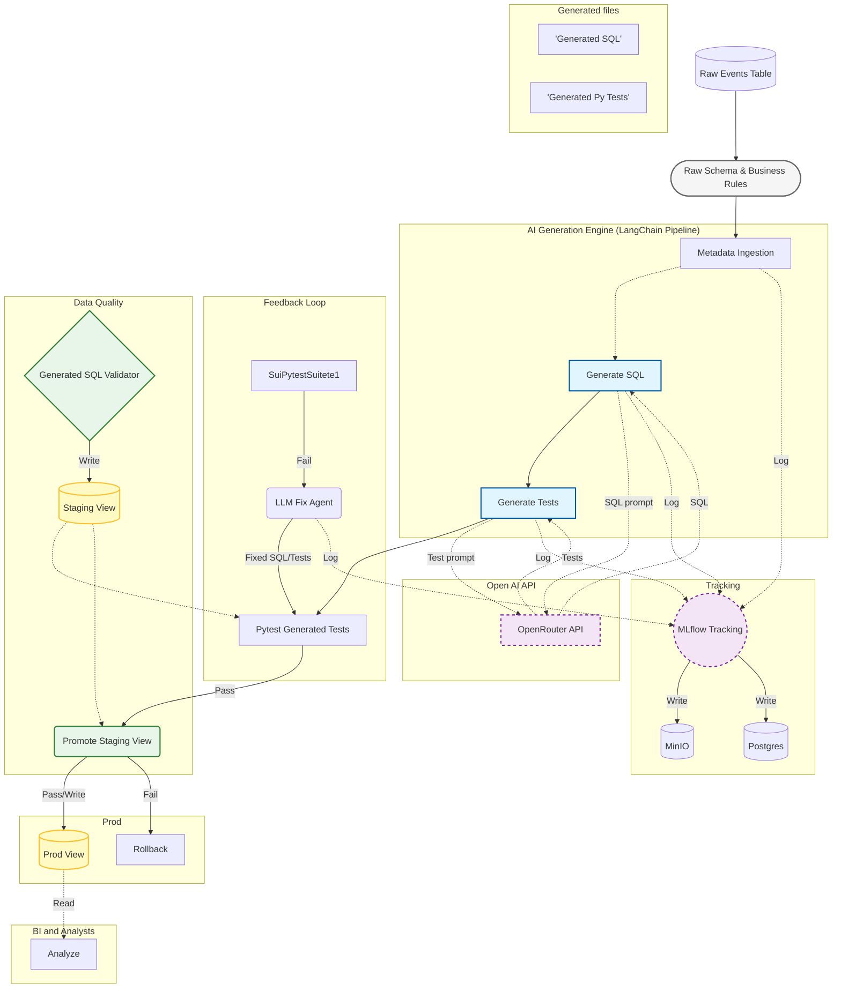
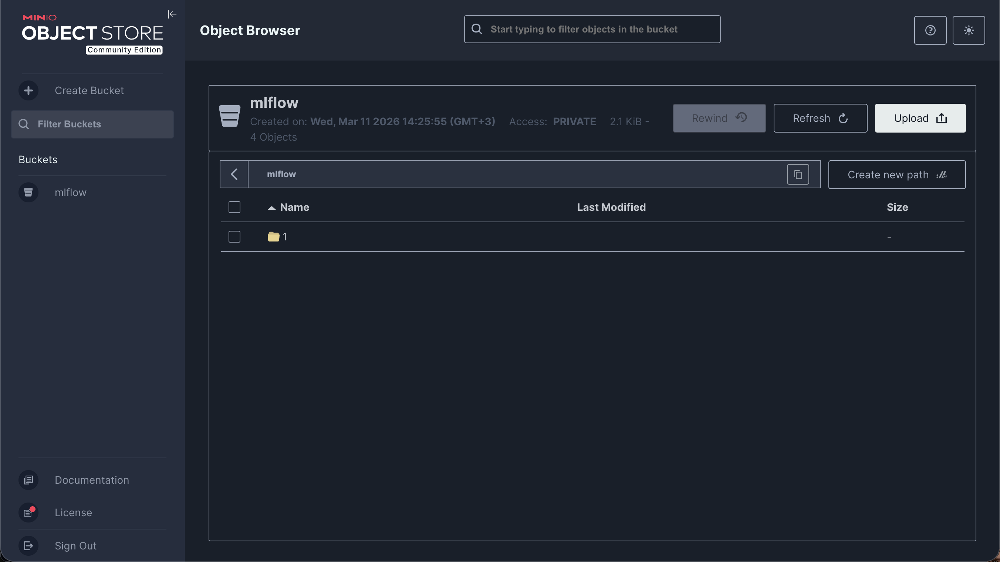
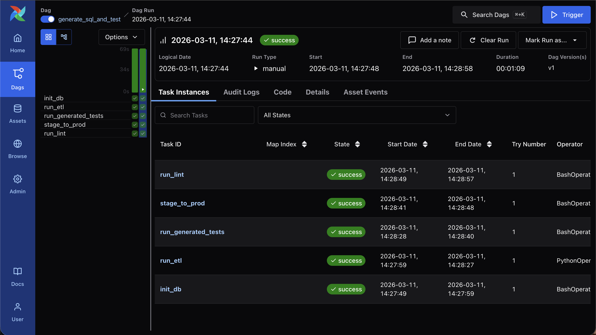
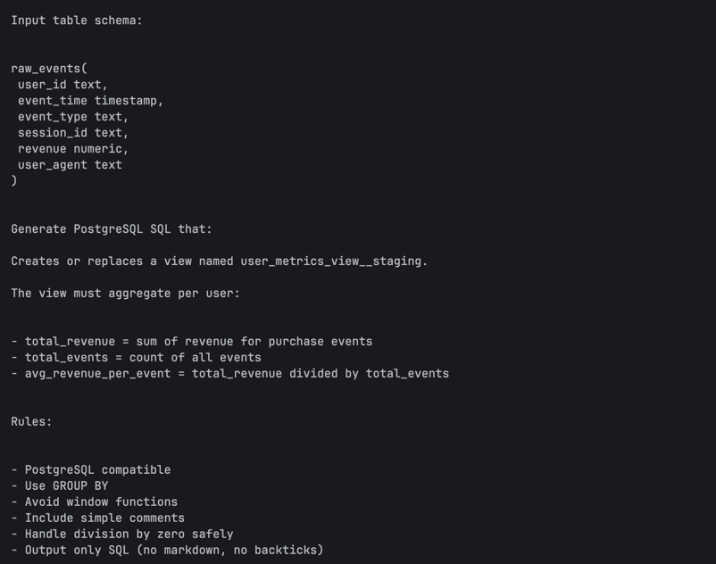
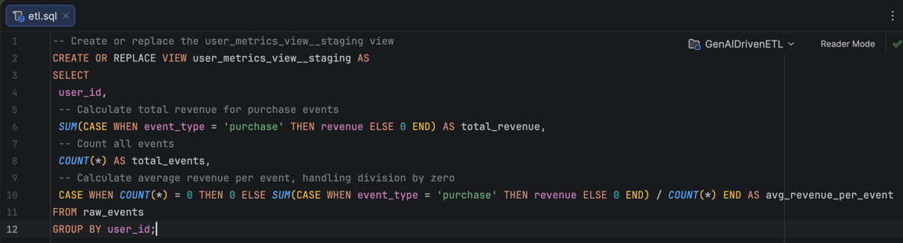
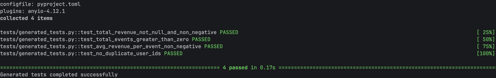
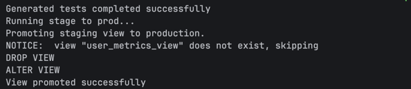

# LangChain SQL & Test Generator

**lang-chain-sql-and-test-generator** is a **LangChain-powered** data engineering project that automatically generates SQL transformations and corresponding pytest tests from raw event schemas and business rules.
It demonstrates how LLM orchestration can be integrated into a production-style ETL workflow with validation, testing, and code quality enforcement, now with **MLflow experiment** tracking for reproducibility and observability.

---

## Architecture Overview


```mermaid
graph TD
    
    %% Nodes Definition
    Table[("Raw Events Table")] --> Start
    Start([Raw Schema & Business Rules]) --> Ingestion[Metadata Ingestion]
    
    subgraph "AI Generation Engine (LangChain Pipeline)"
        Ingestion -.-> SQLGenNode[Generate SQL]       
        SQLGenNode --> TestGenNode[Generate Tests]
    end

    subgraph "Feedback Loop"
        LLMfixPipeline -->|Fixed SQL/Tests| PytestSuite[Pytest Generated Tests]
        SuiPytestSuitete1 -->|Fail| LLMfixPipeline(LLM Fix Agent)
        TestGenNode --> PytestSuite        
    end
        
    subgraph "Open AI API"
        OpenRouter -.->|SQL| SQLGenNode 
        OpenRouter -.->|Tests| TestGenNode
        SQLGenNode -.->|SQL prompt| OpenRouter
        TestGenNode -.->|Test prompt| OpenRouter[OpenRouter API]
    end
    
    subgraph "Tracking"
        Ingestion -.->|Log| MLflow
        SQLGenNode -.->|Log| MLflow((MLflow Tracking))
        TestGenNode -.->|Log| MLflow
        LLMfixPipeline -.->|Log| MLflow
        MLflow -->|Write| MinIO[(MinIO)]
        MLflow -->|Write| PostgresMLflow[(Postgres)]    
    end
    
    subgraph "Data Quality"        
        SQLValidator{Generated SQL Validator} -->|Write| Staging[(Staging View)]
        PytestSuite -->|Pass| Executor
        Staging -.-> PytestSuite
        Staging -.-> Executor("Promote Staging View")
    end
    
    subgraph "Generated files"
        GeneratedSql['Generated SQL']
        GeneratedTests['Generated Py Tests']
    end

    subgraph "Prod"
        Executor -->|Pass/Write| Production[(Prod View)]
        Executor -->|Fail| Rollback[Rollback]
    end
    
    subgraph "BI and Analysts"
        Production -.->|Read| Analyze
    end

    %% Colors and Styles
    classDef startEnd fill:#f5f5f5,stroke:#666,stroke-width:2px,color:#333;
    classDef aiNode fill:#e1f5fe,stroke:#01579b,stroke-width:2px;
    classDef storage fill:#fff9c4,stroke:#fbc02d,stroke-width:2px;
    classDef action fill:#e8f5e9,stroke:#2e7d32,stroke-width:2px;
    classDef tracking fill:#f3e5f5,stroke:#7b1fa2,stroke-width:2px,stroke-dasharray: 5 5;

    class Start,End startEnd;
    class SQLGenNode,TestGenNode,TestGenNode2 aiNode;
    class Staging,Production storage;
    class SQLValidator,Executor,Suite action;
    class MLflow,OpenRouter tracking;
```

---

## 🛡️ Governance & Reliability

This project treats **LLM-generated code as a first-class engineering artifact**. Unlike simple scripts, this pipeline implements a "Trust but Verify" model:

* **Model & Code Registry:** MLflow acts as a central repository, ensuring every generated SQL query and test suite is versioned, auditable, and linked to the specific Prompt/LLM version used.
* **Quality Gates:** Every run logs success metrics. The system prevents "Promotion to Production" (View Commit) unless the specific MLflow Run ID marks all generated tests as `Passed`.
* **Reproducibility:** By logging parameters and schemas, we ensure that any production issue can be debugged by re-running the exact same generation environment.

---

## Features

- `LangChain LCEL`-based orchestration pipeline
- Automatic SQL generation from raw schema + rules
- Automatic `pytest` test generation
- `PostgreSQL` integration (staging → final views)
- SQL validation before execution
- LLM-driven orchestration with `LangChain LCEL`
- `MLflow` tracking for parameters, metrics, and artifacts
- Rollback on test failure
- Automatic feedback loop: If generated tests fail, the LLM attempts to fix SQL or tests automatically and retries execution up to `MAX_RETRIES`.
- Test execution via Poetry ensures isolated, reproducible environment without relying on system Python or Docker.
- PEP8 linting (Black, isort, Flake8)
- Fully reproducible environment via `Poetry`

Fully reproducible environment via Poetry

---

## Agentic Workflow Components

- Schema-driven SQL generation
- Metric aggregation logic generation
- Automated data quality test creation
- LLM-based orchestration via LangChain LCEL
- Experiment tracking and parameter logging via MLflow

---

## Local Setup without Docker and Airflow

### 0) Requirements

- Python 3.11+

- PostgreSQL running locally with configured postgres user:
    ```bash
    brew services start postgresql@16
    ``` 

- Poetry installed

- Run ML flow
    ```bash 
    mlflow server \
    --backend-store-uri sqlite:///mlflow.db \
    --default-artifact-root ./mlartifacts \
    --host 127.0.0.1 \
    --port 5000
    ``` 
  
    __Note__: .gitignore includes mlflow.db and mlruns/ to prevent committing local experiment data.
  
### 1) Clone repository
```bash
git clone https://github.com/RomanDevyatov/lang-chain-sql-and-test-generator.git
cd lang-chain-sql-and-test-generator
```

### 2) Install dependencies
```bash
poetry install
```

### 3) Create .env file in the project root:

 * OPENROUTER_API_KEY=your_openrouter_key
 * DB_NAME=any_db_name
 * DB_HOST=localhost
 * DB_PORT=5432
 * DB_USER=any_db_user
 * DB_PASSWORD=any_db_password
 * VIEW_NAME=any_table_name
 * STAGING_VIEW_NAME=your_any_staging_table_name

### 4) Run pipeline:
```bash
./scripts/old_fashion/run_all.sh
```
- _This script sequentially runs:_
  - init_db.sh
  - run_main_pipeline.sh
  - run_generated_tests.sh
  - run_commit_views.sh
  - run_lint.sh

### *macOS users

Make scripts executable:

```bash
chmod +x ./scripts/old_fashion/*.sh
```

---

## Running the Project with Docker Compose

This project uses **Docker Compose** to run the full stack locally, including:

- **Apache Airflow** (API server, scheduler, DAG processor, triggerer)
- **PostgreSQL** (for Airflow, MLflow and application DB)
- **MLflow** (experiment tracking)
- **MinIO** (S3-compatible artifact storage)

---

### Prerequisites

Make sure you have installed:

- Docker
- Docker Compose

Recommended resources for Docker:

- **15 GB free disk space**

---

### Environment Variables

Create a `.env` file in the project root.

Example:

```env
AIRFLOW_UID=5000
DB_HOST=postgres-app
DB_PORT=5432
DB_USER=app
DB_PASSWORD=app
DB_NAME=appdb

AIRFLOW_DB_USER=airflow
AIRFLOW_DB_PASSWORD=airflow
AIRFLOW_DB_NAME=airflow

AIRFLOW_PROJ_DIR=./airflow
MLFLOW_TRACKING_URI=http://mlflow:5000

VIEW_NAME=any_view_name
STAGING_VIEW_NAME=any_staging_view_name

AWS_ACCESS_KEY_ID=minio
AWS_SECRET_ACCESS_KEY=minio123
AWS_DEFAULT_REGION=us-east-1

S3_ENDPOINT_URL=http://minio:9000
MLFLOW_S3_ENDPOINT_URL=http://minio:9000

OPENROUTER_API_KEY=your_api_key (Obtain it on https://openrouter.ai/)
```

### Build and Start the Stack

Option 1: Build images and start all services:

```cmd
docker compose up --build
```

Option 2: Run in detached mode:
```cmd
docker compose up -d --build
```

---

### First Initialization

During the first run, the container airflow-init will:

- initialize the Airflow database

- run DB migrations

- create a default Airflow user

Default credentials:

    username: airflow
    password: airflow

### Available Services

After startup the following services will be available:

| Service         | URL                   | Description                     |
|-----------------|----------------------|---------------------------------|
| Airflow UI      | http://localhost:8080 | Airflow web interface           |
| MLflow          | http://localhost:5000 | Experiment tracking server      |
| MinIO API       | http://localhost:9000 | S3-compatible storage           |
| MinIO Console   | http://localhost:9001 | MinIO web UI                    |
| Airflow Postgres| localhost:5432        | Airflow database                |
| App Postgres    | localhost:5434        | Application database            |
| MLflow Postgres | localhost:5433        | MLflow metadata database        |

MinIO credentials:

    user: minio
    password: minio123

### Project Volumes

The following directories are mounted into containers:
```
airflow/dags/        -> Airflow DAGs
airflow/logs/        -> Airflow logs
airflow/config/      -> Airflow configuration
airflow/plugins/     -> Airflow plugins
tests/               -> test files
data/                -> project data
```
Changes in these folders are reflected immediately inside the containers.

### Stop the Stack

Stop containers:
```cmd
docker compose down
```

Stop and remove volumes (deletes all databases):
```cmd
docker compose down -v
```

---

## 🕹 Running the Pipeline via Airflow

The pipeline can now be executed and orchestrated using **Apache Airflow**.  
This enables scheduling, monitoring, and logging for all generated SQL and test jobs.

### Airflow DAG

- A DAG named `generate_sql_and_test` is included in the `airflow/dags/` folder.
- The DAG automates the following steps:
  1. **Metadata ingestion** – loads raw schema & business rules
  2. **SQL generation** – generates SQL transformations using the LLM
  3. **SQL validation** – ensures generated queries are correct
  4. **Test generation** – creates pytest tests for each SQL transformation
  5. **Execution & quality gate** – runs tests and promotes to production view if passed
  6. **Logging** – all parameters, artifacts, and results are tracked in **MLflow**

#### Feedback Loop for Failed Tests

- The DAG includes a feedback loop that automatically invokes the LLM to correct failing SQL or test code.
- This occurs immediately after the `run_generated_tests` task if any pytest checks fail.
- Logs of attempts and corrections are recorded, and the pipeline retries up to `MAX_RETRIES` times before raising a runtime error.

### Running the DAG

1. Make sure the Docker Compose stack is running:

```bash
docker compose up -d --build
```

2. Open the Airflow UI:
```
http://localhost:8080
```

3. Locate the generate_sql_and_test DAG in the Airflow DAGs list.

4. Trigger the DAG manually or let it run on a schedule (if configured).

5. Monitor logs for each task directly from the Airflow UI.


### Airflow CLI

Run Airflow commands via CLI container:
```cmd
docker compose run --rm airflow-cli airflow <command>
```
Example:
```cmd
docker compose run --rm airflow-cli airflow dags list
```

### Local Development

Place your DAGs in the `dags/` folder.

Place custom plugins in `plugins/`.

Place test data in `data/`.

Install Python dependencies inside Airflow container if needed:
```cmd
docker compose run --rm airflow-cli pip install <package>
```
Run tests:
```cmd
docker compose run --rm airflow-cli pytest /opt/airflow/tests
```

---

## MLflow Tracking

MLflow tracking is used here as a Model/Code Registry, ensuring that every generated artifact is auditable before it hits production.
It ensures reproducibility and observability.

1. **Experiments Overview**  
Shows all runs with their parameters and status.  


2. **Run Details — Params & Metrics**  
Each run logs input parameters and test/SQL metrics.  


4. **Artifacts**  
Generated SQL and tests are stored as MLflow artifacts.  


5. **MinIO**


---

## Generated Artifacts

SQL:
```bash
data/generated_outputs/sql/etl.sql
```

Tests:
```bash
tests/generated_tests.py
```

Staging View:
```bash
user_metrics_view__staging
```

Final View:
```bash
user_metrics_view
```

All artifacts are logged in MLflow, including parameters, metrics, and generated files.
> Note: If the feedback loop fixes failing tests or SQL, the files in
> `data/generated_outputs/sql/etl.sql` and `tests/generated/generated_tests.py`
> may be updated automatically.

---

## Code Quality

Autoformat code with Black and isort:

```bash
poetry run black .
poetry run isort .
```

Check PEP8 compliance with Flake8:
```bash
poetry run flake8 .
```

Optional: Run full lint script:
```bash
./scripts/run_lint.sh
```

---

## Notes

- ETL SQL is generated automatically and saved under _data/generated_outputs/sql/etl.sql_.
- The project follows security best practices by using environment variables `(.env)` and excluding sensitive data/logs from version control.
- Views such as _user_metrics_view__staging_ and _user_metrics_view_ are created dynamically.
- Add new metrics in `aggregates` in the [sql generation prompt](genaidrivenetl/prompts/v1/sql_prompt.txt).
- Add new tests via `required_checks` in the [test generation prompt](genaidrivenetl/prompts/v1/test_prompt.txt).
- The project uses Poetry for reproducible environments. Check [config file](genaidrivenetl/config.py).
- Experiment tracking via `MLflow` ensures reproducibility and auditability.

---

## Future Roadmap

1. Integration with Vector DB for RAG-based schema lookups.
2. Support for dbt (data build tool) adapter.
3. Automated Cost Estimation for the generated SQL queries.

---

## Screenshots (Airflow)




---

## Screenshots (Local Setup)

1. Prompt to generate SQL query

2. Generated SQL

3. Prompt for test generation

4. Generated tests  

5. Run generated tests
  
Executed generated SQL queries on user event streams and transactional data to produce analytics metrics and validate results  
6. Update the table if tests completed successfully (stage —> prod)

