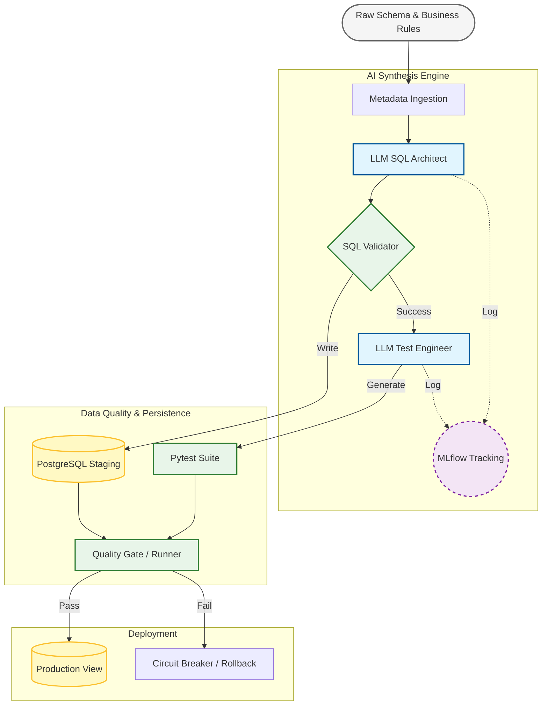

# LangChain SQL & Test Generator

**lang-chain-sql-and-test-generator** is a **LangChain-powered** data engineering project that automatically generates SQL transformations and corresponding pytest tests from raw event schemas and business rules.
It demonstrates how LLM orchestration can be integrated into a production-style ETL workflow with validation, testing, and code quality enforcement, now with **MLflow experiment** tracking for reproducibility and observability.

---

## Architecture Overview


```mermaid
graph TD
    %% Nodes Definition
    Start([Raw Schema & Business Rules]) --> Ingestion[Metadata Ingestion]

    subgraph "AI Synthesis Engine"
        Ingestion --> SQLGenNode[LLM SQL Architect]
        SQLGenNode --> SQLValidator{SQL Validator}
        SQLValidator -->|Success| TestGenNode[LLM Test Engineer]
        
        %% Operational Logs
        SQLGenNode -.->|Log| MLflow((MLflow Tracking))
        TestGenNode -.->|Log| MLflow
    end

    subgraph "Data Quality & Persistence"
        SQLValidator -->|Write| Staging[(PostgreSQL Staging)]
        TestGenNode -->|Generate| Suite[Pytest Suite]
        Suite --> Executor[Quality Gate / Runner]
        Staging --> Executor
    end

    subgraph "Deployment"
        Executor -->|Pass| Production[(Production View)]
        Executor -->|Fail| Rollback[Circuit Breaker / Rollback]
    end

    %% Colors and Styles
    classDef startEnd fill:#f5f5f5,stroke:#666,stroke-width:2px,color:#333;
    classDef aiNode fill:#e1f5fe,stroke:#01579b,stroke-width:2px;
    classDef storage fill:#fff9c4,stroke:#fbc02d,stroke-width:2px;
    classDef action fill:#e8f5e9,stroke:#2e7d32,stroke-width:2px;
    classDef tracking fill:#f3e5f5,stroke:#7b1fa2,stroke-width:2px,stroke-dasharray: 5 5;

    class Start,End startEnd;
    class SQLGenNode,TestGenNode aiNode;
    class Staging,Production storage;
    class SQLValidator,Executor,Suite action;
    class MLflow tracking;
```

---

## 🛡️ Governance & Reliability

This project treats **LLM-generated code as a first-class engineering artifact**. Unlike simple scripts, this pipeline implements a "Trust but Verify" model:

* **Model & Code Registry:** MLflow acts as a central repository, ensuring every generated SQL query and test suite is versioned, auditable, and linked to the specific Prompt/LLM version used.
* **Quality Gates:** Every run logs success metrics. The system prevents "Promotion to Production" (View Commit) unless the specific MLflow Run ID marks all generated tests as `Passed`.
* **Reproducibility:** By logging parameters and schemas, we ensure that any production issue can be debugged by re-running the exact same generation environment.

---

## Features

- `LangChain LCEL`-based orchestration pipeline
- Automatic SQL generation from raw schema + rules
- Automatic `pytest` test generation
- `PostgreSQL` integration (staging → final views)
- SQL validation before execution
- LLM-driven orchestration with `LangChain LCEL`
- `MLflow` tracking for parameters, metrics, and artifacts
- Rollback on test failure
- PEP8 linting (Black, isort, Flake8)
- Fully reproducible environment via `Poetry`

---

## Agentic Workflow Components

- Schema-driven SQL generation
- Metric aggregation logic generation
- Automated data quality test creation
- LLM-based orchestration via LangChain LCEL
- Experiment tracking and parameter logging via MLflow

---

## Setup
### 0) Requirements

- Python 3.11+

- PostgreSQL running locally with configured postgres user:
    ```bash
    brew services start postgresql@16
    ``` 

- Poetry installed

- Run ML flow
    ```bash 
    mlflow server \
    --backend-store-uri sqlite:///mlflow.db \
    --default-artifact-root ./mlartifacts \
    --host 127.0.0.1 \
    --port 5000
    ``` 
  
    __Note__: .gitignore includes mlflow.db and mlruns/ to prevent committing local experiment data.
  
### 1) Clone repository
```bash
git clone https://github.com/RomanDevyatov/lang-chain-sql-and-test-generator.git
cd lang-chain-sql-and-test-generator
```

### 2) Install dependencies
```bash
poetry install
```

### 3) Create .env file in the project root:

 * OPENROUTER_API_KEY=your_openrouter_key
 * DB_NAME=genai_etl_db_any
 * DB_HOST=localhost
 * DB_PORT=5432
 * DB_USER=your_db_user
 * DB_PASSWORD=your_db_password
 * VIEW_NAME=your_table_name_any
 * STAGING_VIEW_NAME=your_staging_table_name_any

### 4) Run pipeline:
```bash
./scripts/run_all.sh
```
- _This script sequentially runs:_
  - init_db.sh
  - run_main_pipeline.sh
  - run_generated_tests.sh
  - run_commit_views.sh
  - run_lint.sh

---

## macOS users

Make scripts executable:

```bash
chmod +x ./scripts/*.sh
```

---

## MLflow Tracking

MLflow tracking is used here as a Model/Code Registry, ensuring that every generated artifact is auditable before it hits production.
It ensures reproducibility and observability.

1. **Experiments Overview**  
Shows all runs with their parameters and status.  


2. **Run Details — Params & Metrics**  
Each run logs input parameters and test/SQL metrics.  


4. **Artifacts**  
Generated SQL and tests are stored as MLflow artifacts.  


---

## Generated Artifacts

SQL:
```bash
data/generated_outputs/sql/etl.sql
```

Tests:
```bash
tests/generated_tests.py
```

Staging View:
```bash
user_metrics_view__staging
```

Final View:
```bash
user_metrics_view
```

All artifacts are logged in MLflow, including parameters, metrics, and generated files.

---

## Code Quality

Autoformat code with Black and isort:

```bash
poetry run black .
poetry run isort .
```

Check PEP8 compliance with Flake8:
```bash
poetry run flake8 .
```

Optional: Run full lint script:
```bash
./scripts/run_lint.sh
```
---

## Notes

- ETL SQL is generated automatically and saved under _data/generated_outputs/sql/etl.sql_.
- The project follows security best practices by using environment variables `(.env)` and excluding sensitive data/logs from version control.
- Views such as _user_metrics_view__staging_ and _user_metrics_view_ are created dynamically.
- Add new metrics in `aggregates` in the [sql generation prompt](genaidrivenetl/prompts/v1/sql_prompt.txt).
- Add new tests via `required_checks` in the [test generation prompt](genaidrivenetl/prompts/v1/test_prompt.txt).
- The project uses Poetry for reproducible environments. Check [config file](genaidrivenetl/config.py).
- Experiment tracking via `MLflow` ensures reproducibility and auditability.

---

## Future Roadmap

1. Integration with Vector DB for RAG-based schema lookups.
2. Support for dbt (data build tool) adapter.
3. Automated Cost Estimation for the generated SQL queries.

---

## Screenshots

1. Prompt to generate SQL query

2. Generated SQL

3. Prompt for test generation

4. Generated tests  

5. Run generated tests
  
Executed generated SQL queries on user event streams and transactional data to produce analytics metrics and validate results  
6. Update the table if tests completed successfully (stage —> prod)

