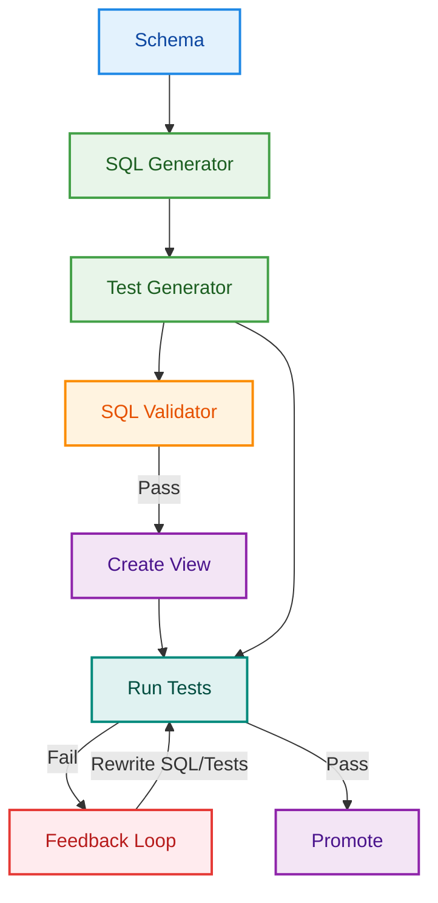
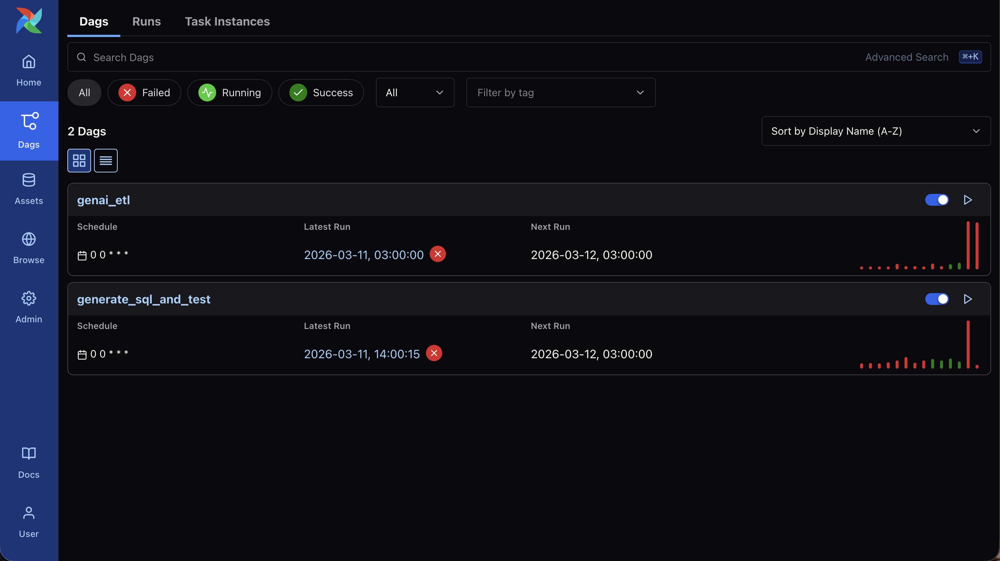
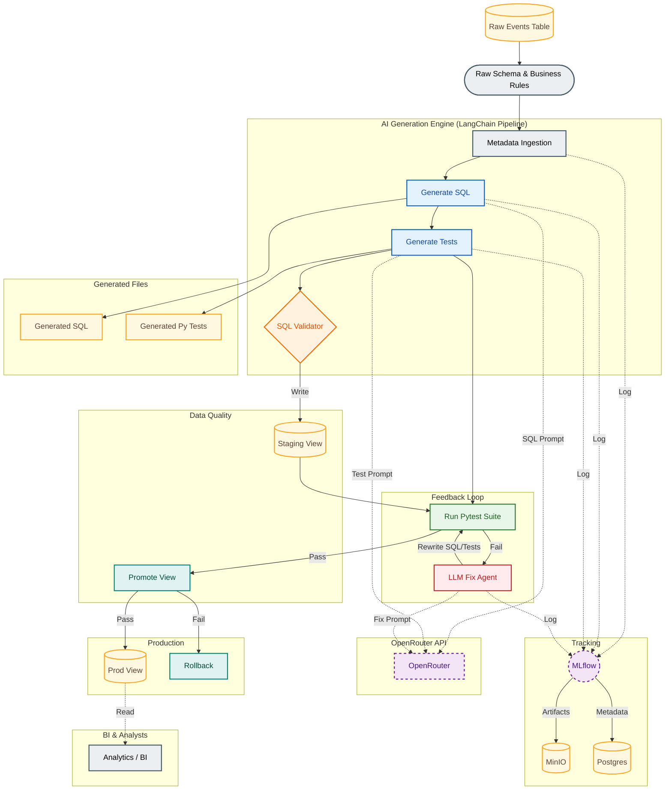

# AI-Driven SQL & Test Generator

An AI-driven data pipeline that generates SQL transformations and corresponding pytest tests from raw schemas.  
The system validates generated SQL and uses a self-correcting feedback loop to ensure correctness before promoting changes to production.

Stack: LangChain · Airflow · MLflow · MinIO · PostgreSQL · Docker

## Overview

This project implements an AI-driven data pipeline that generates SQL transformations and pytest tests from raw schemas. All outputs are validated, and any failing SQL or tests are automatically corrected via a self-correcting feedback loop before promotion to production.

Workflow is orchestrated with Airflow; all parameters, artifacts, and metrics are logged in MLflow for reproducibility and observability. This enables automated, zero-touch promotion of production-ready transformations.

Metadata ingestion → SQL generation (LLM) → Validation → Test generation → Test execution → Feedback loop → Staging → Production → MLflow tracking

## Pipeline Steps

- Metadata ingestion – Load raw schema definitions and business rules.

- SQL generation – LLM generates analytics SQL from raw schema.

- Validation – SQL is validated for correctness.

- Test generation – Pytest-based data quality tests are generated automatically.

- Test execution – Tests run against the staging view.

- Feedback loop – Failures trigger LLM to correct SQL/tests up to MAX_RETRIES.

- Promotion – Passing transformations are promoted to production.

- Tracking – All parameters, generated SQL, tests, and metrics logged in MLflow; artifacts stored in MinIO.

### Logical Pipeline Overview


```mermaid
graph TD
   %% Nodes
   Schema[Schema]
   SQLGen[SQL Generator]
   TestGen[Test Generator]
   SQLValidator[SQL Validator]
   CreateView[Create View]
   Tests[Run Tests]
   Feedback[Feedback Loop]
   Promote[Promote]

   %% Flow
   Schema --> SQLGen
   SQLGen --> TestGen
   TestGen --> SQLValidator
   SQLValidator -->|Pass| CreateView
   CreateView --> Tests
   TestGen --> Tests
   Tests -->|Fail| Feedback
   Feedback -->|Rewrite SQL/Tests| Tests
   Tests -->|Pass| Promote

   %% Styling
   classDef source fill:#E3F2FD,stroke:#1E88E5,stroke-width:2px,color:#0D47A1;
   classDef process fill:#E8F5E9,stroke:#43A047,stroke-width:2px,color:#1B5E20;
   classDef validation fill:#FFF3E0,stroke:#FB8C00,stroke-width:2px,color:#E65100;
   classDef action fill:#F3E5F5,stroke:#8E24AA,stroke-width:2px,color:#4A148C;
   classDef result fill:#E0F2F1,stroke:#00897B,stroke-width:2px,color:#004D40;
   classDef feedback fill:#FFEBEE,stroke:#E53935,stroke-width:2px,color:#B71C1C;

   %% Apply classes
   class Schema source;
   class SQLGen,TestGen process;
   class SQLValidator validation;
   class CreateView action;
   class Tests result;
   class Promote action;
   class Feedback feedback;
```

*Full architecture diagram below for reference*

---

## Reliability & Governance

LLM-generated SQL and pytest tests are treated as production artifacts. Validation, automated tests, and a self-correcting feedback loop ensure safe promotion from staging to production. All runs are logged in MLflow for reproducibility and auditability.

---

## Features

- SQL generation + pytest tests from raw schemas using LLMs
- Validation & feedback loop for safe promotion
- Airflow orchestration & MLflow tracking
- PostgreSQL integration with staging → production promotion
- Reproducible environment via Poetry, code quality checks

---

## Tech Stack

| Category | Tools |
|--------|------|
| LLM orchestration | LangChain (LCEL) |
| Orchestration | Apache Airflow |
| Experiment tracking | MLflow |
| Storage | MinIO |
| Database | PostgreSQL |
| Environment | Docker, Poetry |

---

## Quick Start

### Prerequisites

- Docker
- Docker Compose

```bash
git clone https://github.com/RomanDevyatov/lang-chain-sql-and-test-generator
cd lang-chain-sql-and-test-generator
cp .env.example .env
docker compose up -d --build
```

Open the Airflow UI: http://localhost:8080

Trigger the `generate_sql_and_test` DAG and monitor task logs.

For detailed developer documentation and step-by-step instructions, see [Documentation](docs/DOCUMENTATION.md).

---

## Example Pipeline Run

This section demonstrates a typical execution of the `generate_sql_and_test` DAG.

### 1. Input: Raw Schema & Business Rules

```yaml
raw_schema:
  - user_id: text
  - event_time: timestamp
  - revenue: numeric

business_rules:
  - "Ignore events with null user_id"
aggregates: ...

```

You can find values in [config](app/genaidrivenetl/config.py)

### 2. SQL Generation (LLM Output)
```sql
CREATE OR REPLACE VIEW user_metrics_view__staging AS
SELECT
    user_id,
    DATE(event_time) AS event_date,
    SUM(revenue) AS daily_revenue
FROM raw_events
WHERE user_id IS NOT NULL
GROUP BY user_id, DATE(event_time);
```

### 3. Test Generation (LLM Output)
```pytest
def test_no_null_user_id(df):
    assert df['user_id'].isnull().sum() == 0
...
```

### 4. Test Execution & Quality Gate

- Tests run against the staging view.

- ✅ All tests passed → staging view promoted to production.

### 5. Promotion to Production

- user_metrics_view__staging → user_metrics_view

### 6. Experiment Logging (MLflow)

- Run parameters logged: schema, rules, LLM version

- Artifacts: generated SQL, tests

- Metrics: test pass/fail status, execution time

- Artifacts are stored in MinIO (s3://mlflow/), ensuring reproducibility.

---

## MLflow Tracking

MLflow tracking is used here as a Model/Code Registry, ensuring that every generated artifact is auditable before it hits production.
It ensures reproducibility and observability.

1. **Experiments Overview** 
Shows all runs with their parameters and status. 


2. **Run Details — Params & Metrics** 
Each run logs input parameters and test/SQL metrics. 


3. **Artifacts** – generated SQL and tests are stored in MLflow.  
   Artifacts are stored in MinIO (S3-compatible storage).

---

## Screenshots (Airflow)




---

## Detailed Architecture Overview


```mermaid
graph TD

   %% مصادر
   Table[("Raw Events Table")] --> Start
   Start([Raw Schema & Business Rules]) --> Ingestion[Metadata Ingestion]

   %% AI ENGINE
   subgraph "AI Generation Engine (LangChain Pipeline)"
       Ingestion --> SQLGenNode[Generate SQL]
       SQLGenNode --> TestGenNode[Generate Tests]
       TestGenNode --> SQLValidator
   end

   %% GENERATED FILES
   subgraph "Generated Files"
       GeneratedSql["Generated SQL"]
       GeneratedTests["Generated Py Tests"]
   end

   SQLGenNode --> GeneratedSql
   TestGenNode --> GeneratedTests

   %% FEEDBACK LOOP
   subgraph "Feedback Loop"
       TestGenNode --> PytestSuite[Run Pytest Suite]
       PytestSuite -->|Fail| LLMfixPipeline[LLM Fix Agent]
       LLMfixPipeline -->|Rewrite SQL/Tests| PytestSuite
   end

   %% DATA QUALITY
   subgraph "Data Quality"
       SQLValidator{SQL Validator} -->|Write| Staging[(Staging View)]
       Staging --> PytestSuite
       PytestSuite -->|Pass| Executor[Promote View]
   end

   %% API
   subgraph "OpenRouter API"
       SQLGenNode -.->|SQL Prompt| OpenRouter[OpenRouter]
       TestGenNode -.->|Test Prompt| OpenRouter
       LLMfixPipeline -.->|Fix Prompt| OpenRouter
   end

   %% TRACKING
   subgraph "Tracking"
       Ingestion -.->|Log| MLflow((MLflow))
       SQLGenNode -.->|Log| MLflow
       TestGenNode -.->|Log| MLflow
       LLMfixPipeline -.->|Log| MLflow

       MLflow -->|Artifacts| MinIO[(MinIO)]
       MLflow -->|Metadata| PostgresMLflow[(Postgres)]
   end

   %% PRODUCTION
   subgraph "Production"
       Executor -->|Pass| ProdView[(Prod View)]
       Executor -->|Fail| Rollback[Rollback]
   end

   %% BI
   subgraph "BI & Analysts"
       ProdView -.->|Read| Analyze[Analytics / BI]
   end

   %% ===== STYLES (HIGH READABILITY) =====

   classDef source fill:#ECEFF1,stroke:#455A64,stroke-width:2px,color:#000;
   classDef ai fill:#E3F2FD,stroke:#1565C0,stroke-width:2px,color:#0D47A1;
   classDef validation fill:#FFF3E0,stroke:#EF6C00,stroke-width:2px,color:#E65100;
   classDef test fill:#E8F5E9,stroke:#2E7D32,stroke-width:2px,color:#1B5E20;
   classDef storage fill:#FFF8E1,stroke:#F9A825,stroke-width:2px,color:#5D4037;
   classDef action fill:#E0F2F1,stroke:#00897B,stroke-width:2px,color:#004D40;
   classDef feedback fill:#FFEBEE,stroke:#C62828,stroke-width:2px,color:#B71C1C;
   classDef tracking fill:#F3E5F5,stroke:#6A1B9A,stroke-width:2px,color:#4A148C,stroke-dasharray: 5 5;

   %% APPLY
   class Table,GeneratedSql,GeneratedTests,Staging,ProdView,MinIO,PostgresMLflow storage;
   class Start,Ingestion,Analyze source;
   class SQLGenNode,TestGenNode ai;
   class SQLValidator validation;
   class PytestSuite test;
   class Executor,Rollback action;
   class LLMfixPipeline feedback;
   class MLflow,OpenRouter tracking;
```
