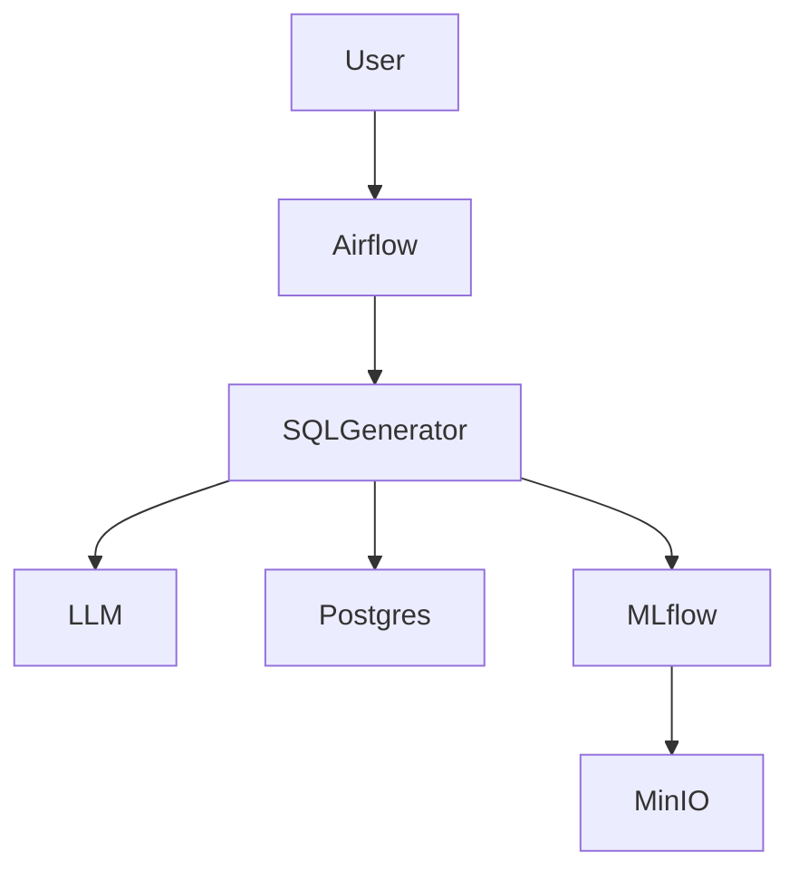
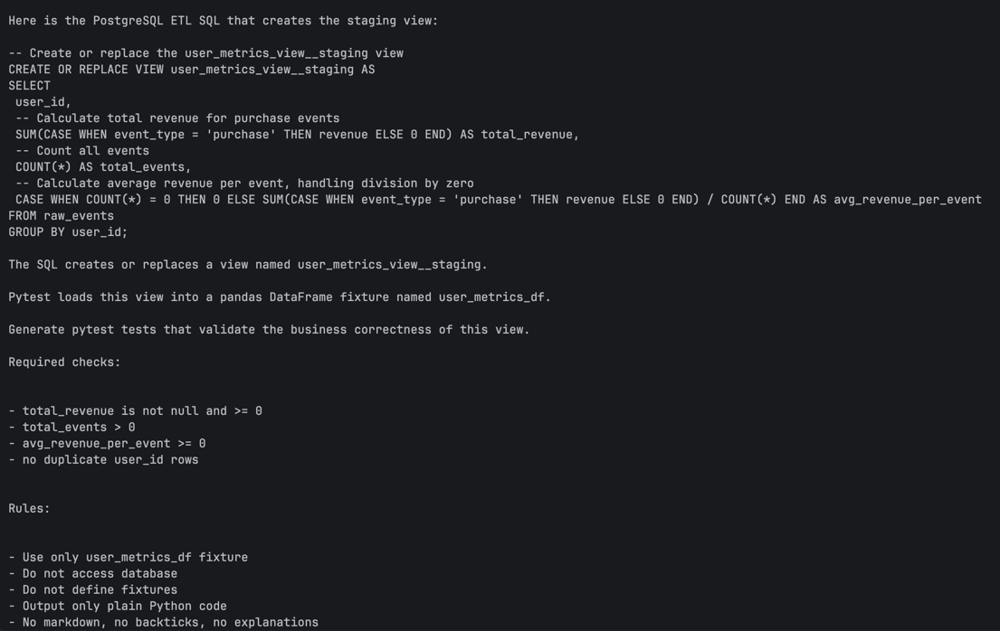
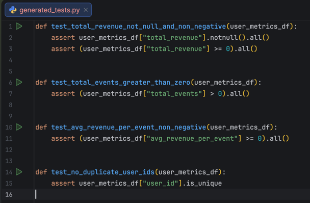

# Documentation

---

## System architecture diagram




---

### Project Volumes

The following directories are mounted into Docker containers.  
Changes in these folders are immediately reflected inside the containers:

| Host Directory        | Container Path        | Purpose                         |
|----------------------|--------------------|---------------------------------|
| `airflow/dags/`       | `/opt/airflow/dags/`   | Airflow DAG definitions         |
| `airflow/logs/`       | `/opt/airflow/logs/`   | Scheduler & task logs           |
| `airflow/config/`     | `/opt/airflow/config/` | Airflow configuration           |
| `airflow/plugins/`    | `/opt/airflow/plugins/`| Custom Airflow plugins          |
| `tests/`              | `/opt/airflow/tests/`  | Test scripts and suites         |
| `data/`               | `/opt/airflow/data/`   | Input/output data for the pipeline |

---

### Running Services

After starting the stack with Docker Compose the following services are available:

| Service | URL | Description |
|-------|-----|-------------|
| Airflow UI | http://localhost:8080 | Airflow web interface |
| MLflow | http://localhost:5000 | Experiment tracking server |
| MinIO API | http://localhost:9000 | S3-compatible storage |
| MinIO Console | http://localhost:9001 | MinIO web UI |
| Airflow Postgres | localhost:5432 | Airflow database |
| App Postgres | localhost:5434 | Application database |
| MLflow Postgres | localhost:5433 | MLflow metadata database |

---

### Obtaining an OpenRouter API Key

The project uses OpenRouter for LLM prompts. To run the pipeline, you need an API key.

- Go to https://openrouter.ai/

- Sign up for an account or log in if you already have one.

- Navigate to API Keys in your account dashboard.

- Click Create New Key (or copy an existing one).

- Add the key to your .env file:

    OPENROUTER_API_KEY=your_api_key_here

⚠️ Keep your API key secret. Do not commit it to version control.

Restart Docker Compose or your environment so the pipeline can access the key.

---

### Running the Pipeline via Airflow

Once the Docker Compose stack is running, the pipeline can be executed and orchestrated using **Apache Airflow**, enabling scheduling, monitoring, and logging for all generated SQL and test jobs.

#### Airflow DAG

- A DAG named `generate_sql_and_test` is included in `airflow/dags/`.
- The DAG automates these steps:

  1. **Metadata Ingestion** – loads raw schema & business rules.
  2. **SQL Generation** – generates SQL transformations using the LLM.
  3. **SQL Validation** – ensures generated queries are correct.
  4. **Test Generation** – creates pytest tests for each SQL transformation.
  5. **Execution & Quality Gate** – runs tests and promotes the staging view to production if passed.
  6. **Logging** – all parameters, artifacts, and results are tracked in **MLflow**.

#### Feedback Loop for Failed Tests

- If SQL validation or tests fail, the DAG automatically invokes the LLM to correct the SQL or test code.
- Corrections are retried up to `MAX_RETRIES`.
- Logs of each attempt and correction are recorded for auditability.

---

### Local Setup without Docker and Airflow


Requirements

- Python 3.11+
- PostgreSQL running locally
- Poetry
- MLflow

- Start running MLflow locally
  ```bash
  mlflow server \
   --backend-store-uri sqlite:///mlflow.db \
   --default-artifact-root ./mlartifacts \
   --host 127.0.0.1 \
   --port 5000
   ```

Setup
```bash
git clone https://github.com/RomanDevyatov/lang-chain-sql-and-test-generator.git
cd lang-chain-sql-and-test-generator
cd app
poetry install
```

Create your own .env in the project root from .env.example

Run pipeline:
```bash
./scripts/old_fashion/run_all.sh
```

(macOS users may need:)
```bash
chmod +x ./scripts/old_fashion/*.sh
```

### Stopping the Stack

To stop the running Docker Compose stack:

```bash
docker compose down
```
To stop and also remove all volumes (this deletes all databases and persisted data):
```bash
docker compose down -v
```
⚠️ Warning: Using -v will remove all data stored in PostgreSQL and MinIO. Use only if you want a full reset.

### Generated Artifacts

All SQL, test files, and views are automatically generated and logged in MLflow:

- **SQL:** `data/generated_outputs/sql/etl.sql`
- **Tests:** `tests/generated_tests.py`
- **Staging View:** `user_metrics_view__staging`
- **Final View:** `user_metrics_view`

> Note: If the feedback loop fixes failing tests or SQL, these files may be updated automatically.

---

### Code Quality & Best Practices

- Autoformat: `poetry run black . && poetry run isort .`
- Lint & PEP8 check: `poetry run flake8 .`
- Optional: run full lint script: `./scripts/run_lint.sh`
- Uses Poetry for reproducible environment and `.env` for secure config.
- Experiment tracking via MLflow ensures reproducibility and auditability.

---

### Notes

- Views are dynamically created and can be extended via the SQL/Test generation prompts.
- Artifacts are stored in MinIO (S3-compatible) for persistence.

---

### Future Roadmap

1. Integration with Vector DB for RAG-based schema lookups.
2. Support for dbt adapter.
3. Automated cost estimation for generated SQL queries.

---


### Screenshots (Local Setup)


1. Prompt to generate SQL query

2. Generated SQL

3. Prompt for test generation

4. Generated tests 

5. Run generated tests
 
Executed generated SQL queries on user event streams and transactional data to produce analytics metrics and validate results 
6. Update the table if tests completed successfully (stage —> prod)


